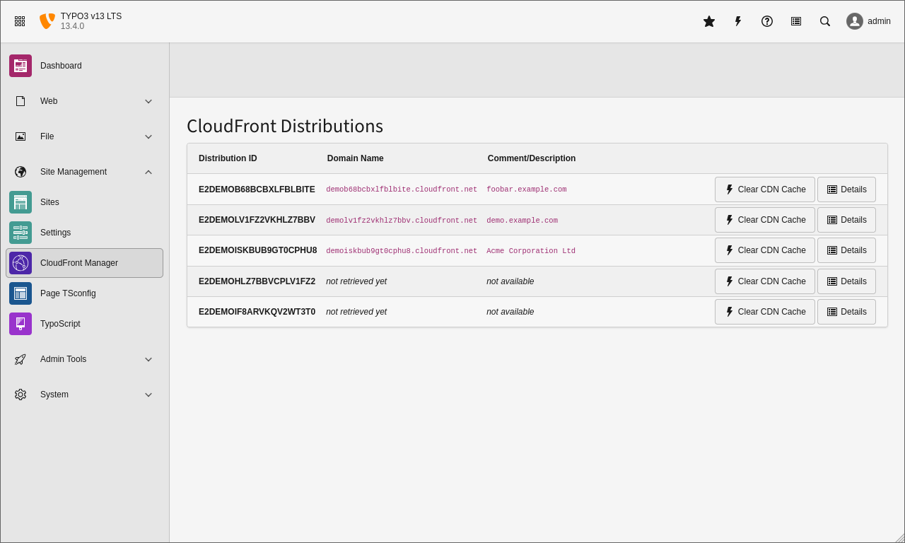
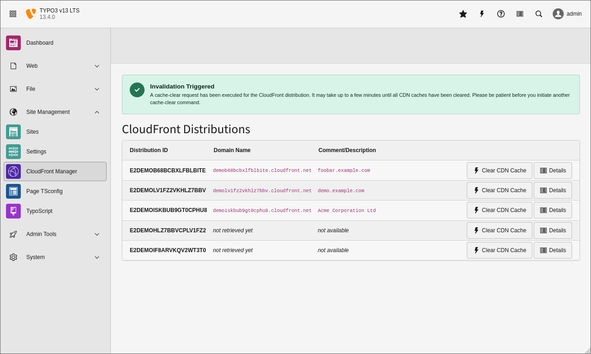
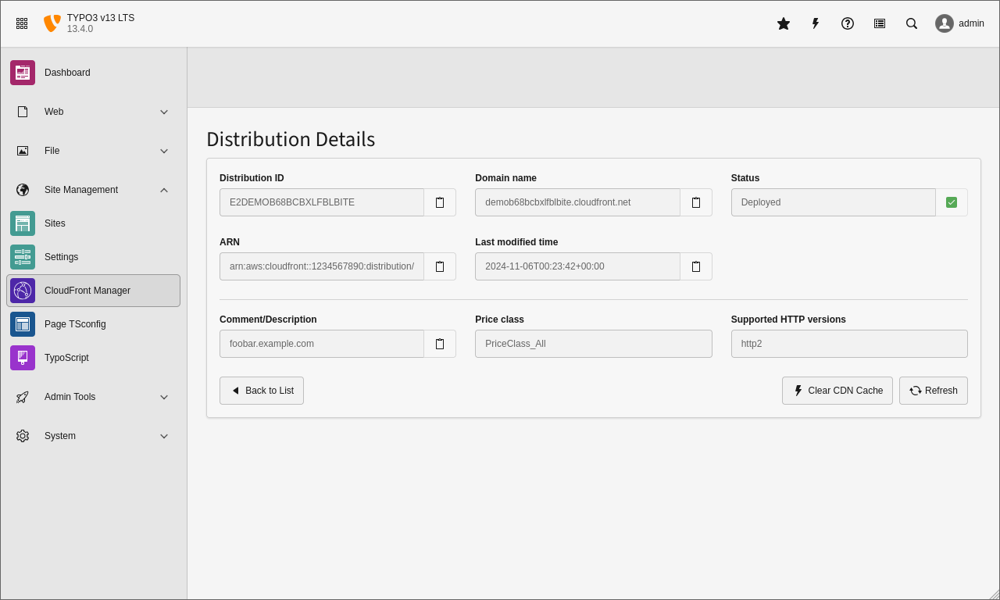

# Introduction

## Screenshots

### List View

The first screenshot shows the list view of the backend module in TYPO3 v13 LTS. Since the detail views of the last two CloudFront distributions in the list haven't been accessed, their domain names and comments/descriptions are not available yet.

### Invalidation Triggered

The second screenshot shows the success message if a user triggers an invalidation by clicking on the button **Clear CDN Cache**.

### Detail View

The third screenshot shows the most important details of a CloudFront distribution. This screen comes up if a user clicks the button **Details** in the list view.

You can copy the values into your clipboard for later usage, and you can also clear the CDN cache from the details view.

----
◀ Previous topic: [Introduction](../Introduction/README.md) ▪ Next topic: [Installation](../Installation/README.md) ▶
