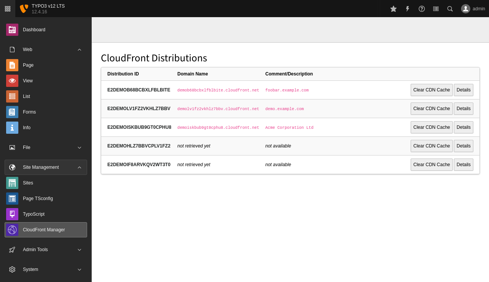
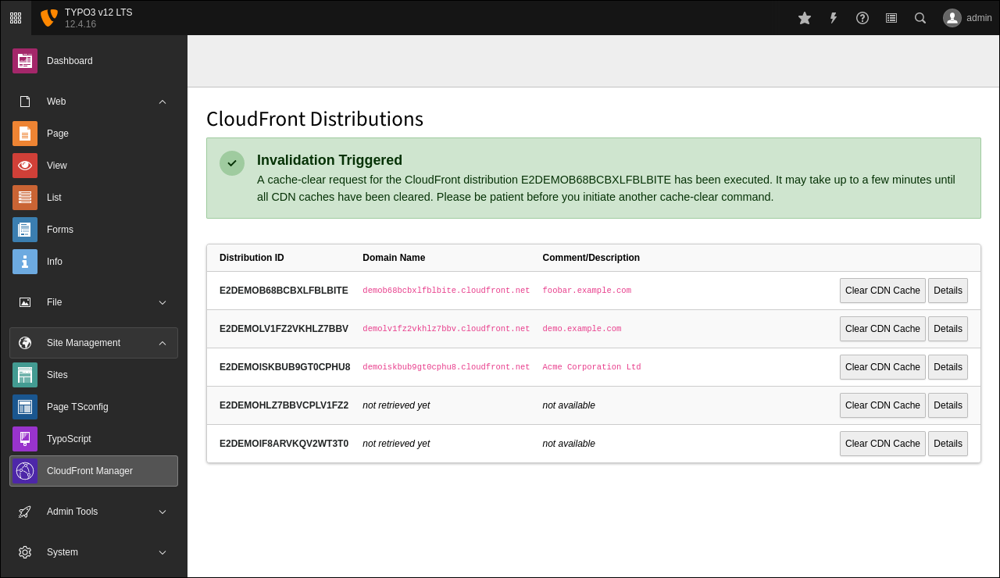
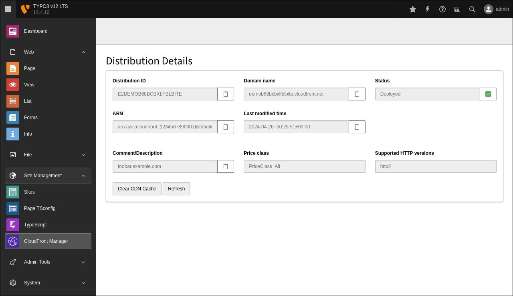

# Introduction

## Screenshots

### List View

The first screenshots show the list view of the backend module in TYPO3 v12 LTS. The domain names and comments/descriptions of the last two CloudFront distributions are not yet available as the details haven't been accessed and retrieved from AWS yet.

### Invalidation Triggered

The second screenshot shows the success message if a user clicks on the button **Clear CDN Cache** and triggers an invalidation.

### Detail View

The third screenshot shows the most important details of a CloudFront distribution. This screen comes up if a user clicks the button **Details**.

You can copy the values into your clipboard for later usage, and you can also clear the CDN cache from the details view.

----
◀ Previous topic: [Introduction](../Introduction/README.md) ▪ Next topic: [Installation](../Installation/README.md) ▶
