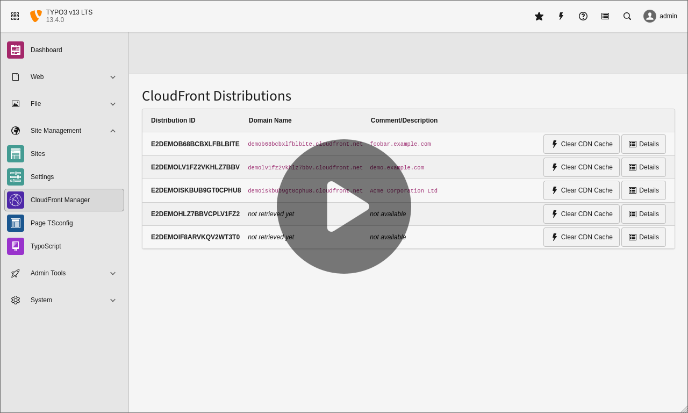

# AWS CloudFront Manager

This [TYPO3](https://typo3.org) extension provides a backend module to let backend users with appropriate access privileges clear the CDN cache of [Amazon CloudFront](https://aws.amazon.com/cloudfront/) distributions (*cache invalidations*).

[](https://t3rrific.com/videos/aws-cloudfront-manager-for-typo3/)

➤ Read the [documentation](https://github.com/typo3-on-aws/aws-cloudfront-manager/blob/release/Documentation/README.md) for further details.

## Requirements and Compatibility

- TYPO3 v12 LTS, PHP 8.1 or higher (extension version 1.x).
- TYPO3 v13 LTS, PHP 8.2 or higher (extension version 2.x).

## Quick Installation Guide

I recommend to use [Composer](https://getcomposer.org/) to install the extension:

```bash
composer require t3rrific/aws-cloudfront-manager
```

➤ Follow the configuration steps in the [documentation](https://github.com/typo3-on-aws/aws-cloudfront-manager/blob/release/Documentation/README.md) to complete the installation.

## License

(c) 2024 Michael Schams | [<schams.net>](https://schams.net) | [t3rrific.com](https://t3rrific.com), all rights reserved.

This program is free software. You can redistribute it and/or modify it under the terms of the GNU General Public License as published by the Free Software Foundation, either version 3 of the License, or (at your option) any later version. This program is distributed in the hope that it will be useful, but WITHOUT ANY WARRANTY; without even the implied warranty of MERCHANTABILITY or FITNESS FOR A PARTICULAR PURPOSE. See the GNU General Public License for more details.

You should have received a copy of the GNU General Public License along with this program. If not, see <https://www.gnu.org/licenses/>.

➤ Read more: [The GNU General Public License](https://www.gnu.org/licenses/gpl-3.0.html).
